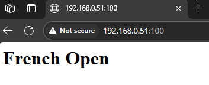
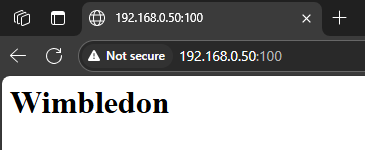
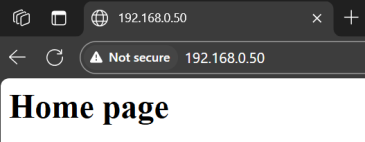
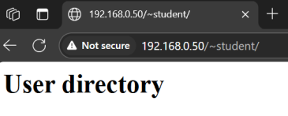
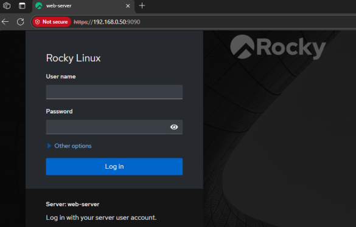

# Introduce to Rocky Linux 9
Rocky Linux 9 is built directly from RHEL 9 sources and has identical features, fixes and behavior.  
# 1. Apache installation
1. Update system then install HTTP packages.  
```bash
sudo dnf update -y
sudo dnf install httpd
```
2. Start the service immediately and configure the service to start after each system boot.  
```bash
sudo systemctl start httpd
sudo systemctl enable httpd
```
3. Status check.  
```bash
sudo systemctl status httpd
```
4. Allow HTTP and HTTPS traffic in the firewall.  
```bash
sudo firewall-cmd --permanent --add-service=http
sudo firewall-cmd --permanent --add-service=https
sudo firewall-cmd --reload
```

# 2. Introductory scenario
1. Check the existing existence of the host. Change the host to web-server . Then check if Apache is running and set static IP addresses on the interface.  
2. Create the main directory /www and subpages in this directory /wimbledon and /french-open
3. Create index.html files in the main directory and subpages.
4. Set permissions.
5. Configure Apache VirtualHosts on port 100.
6. Set up Apache on port 100.
7. Allow access through port 100 in firewalld
8. Configure SELinux to allow Apache to use non-standard ports.
9. Configure access to the website located in the user's directory via the userdir module.
10. Test access to websites.
12. After adding a 2 GB disk to the machine, create two partitions of 1 GB each with automatic punting after reboot.
13. Check the technical condition of this disk with smartctl.
14. Create the Guests group and the Guest-1 user with a home directory for which the maximum number of days between password changes is 5 days.
15. Assign the Guest-1 account to the Guests group.
16. In the Guest-1 home directory, create a hidden documents directory and give it full rights for the Guests group.
17. Create files file-1, file-2 and file-3 in Guest-1's home directory. Then create a compressed .tar.gz archive from these files.
18. Log in as root.
19. Execute the command alias top -b -n 1 | head -n 17
20. Check the complete information about the system kernel.
21. Check the version and name of the distribution.
22. Check system uptime and load.
23. Check what uses the most RAM.
24. Check the parameters of the motherboard, processor, RAM, network cards.
25. Check the sysk and partition structure.
26. Check the active connection and listening ports.
27. View system logs.
28. View kernel messages.

## Solution

1. 
```bash
su -
hostnamectl status
hostnamectl set-hostname web-server
systemctl status httpd
nmcli connection show
sudo nmcli con modify "enp0s2" ipv4.method manual ipv4.addresses "192.168.0.50/24,192.168.0.51/24" ipv4.gateway 192.168.0.1 ipv4.dns 8.8.8.8
nmcli con up "enp0s2"
```
2.  
```bash
mkdir -p /www/wimbledon
mkdir -p /www/french-open
```
3. 
```bash
echo "<h1>Wimbledon</h1>" | sudo tee /www/wimbledon/index.html
echo "<h1>French Open</h1>" | sudo tee /www/french-open/index.html
echo "<h1>Home page</h1>" | sudo tee /www/index.html
```
4.  
```bash
chown -R apache:apache /www
chmod -R 755 /www
```
5. Creating a custom-sites.conf file with an entry.  
```bash
nano /etc/httpd/conf.d/custom-sites.conf
```
```bash
<VirtualHost 192.168.0.50:100>
    DocumentRoot "/www/wimbledon"
    <Directory "/www/wimbledon">
        AllowOverride None
        Require all granted
    </Directory>
</VirtualHost>

<VirtualHost 192.168.0.51:100>
    DocumentRoot "/www/french-open"
    <Directory "/www/french-open">
        AllowOverride None
        Require all granted
    </Directory>
</VirtualHost>

<VirtualHost *:80>
    DocumentRoot "/www"
    ServerName 192.168.0.50
    <Directory "/www">
        AllowOverride None
        Require all granted
    </Directory>
</VirtualHost>
```
6. Added Listen 100 listening.  
```bash
nano /etc/httpd/conf.d/custom-sites.conf
```
7.  
```bash
firewall-cmd --permanent --add-port=100/tcp
firewall-cmd --reload  
```  
8.  Adding TCP port 100 to the SELinux context as allowed for the HTTP server.  
```bash
semanage port -a -t http_port_t -p tcp 100
```
Assign the SELinux label httpd_sys_content_t to the /www directory and all its subdirectories and files.  
```bash
semanage fcontext -a -t httpd_sys_content_t "/www(/.*)?"
```
Restore SELinux contexts to files in /www, according to previously assigned rules.  
```bash
restorecon -Rv /www
```
Restarting Apache.  
```bash
systemctl restart httpd
```

Browser accessibility test.  

http://192.168.0.50:100 - will show the French Open website  
  
http://192.168.0.51:100 - will show the Wimbledon website  
  
http://192.168.0.50 - show home page  
http://192.168.0.51 - show home page   
  
9.  Enabling the UserDir module by editing the /etc/httpd/conf.d/userdir.conf file.  
```bash
<IfModule mod_userdir.c>
    UserDir public_html
    UserDir enabled student
</IfModule>

<Directory "/home/*/public_html">
    AllowOverride None
    Require all granted
</Directory>
```
Execution of the command  
```bash
httpd -M | grep userdir
```
should return userdir module (shared). Allow Apache to access user directories.  
```bash
setsebool -P httpd_enable_homedirs on
```
Set Linux context for ~/public_html directory.  
```bash
semanage fcontext -a -t httpd_user_content_t "/home/student/public_html(/.*)?"
restorecon -Rv /home/student/public_html
```
Configuring the user's home directory.  
```bash
mkdir ~/public_html
echo "<h1>User directory</h1>" > ~/public_html/index.html
chmod 711 ~
chmod 711 ~
```
10. Browser accessibility test of the user's home directory.  

http://192.168.0.50/~student - will show the page in the student user directory  
  

21. 
```bash
cat /etc/os-release
```
22. 
```bash
uptime
```


# 3. How to secure Rocky Linux 9
## Logging failed login attempts to a text file.  
```bash
grep "Failed password" /var/log/secure > failed-password.txt 
```
### Changing the SSH port  
In any text editor, open the file /etc/ssh/sshd_config.
```bash
nano /etc/ssh/sshd_config
```
Find the line with #Port 22 remove # and change it to example Port 14355.
Check the current SELinux mode:
```bash
sestatus
```
Be sure to add port 14355 to SELinux. Replace &lt;type&gt;, &lt;protocol&gt;, and &lt;port_number&gt; in command semanage port -a -t &lt;type&gt; -p &lt;protocol&gt; &lt;port_number&gt;.
```bash
semanage port -a -t ssh_port_t -p tcp 14355
```
Change the Firewall
```
sudo firewall-cmd --permanent --add-port=14355/tcp
sudo firewall-cmd --reload
```
Restarting the ssh service.
```bash
systemctl restart sshd
```
### Blocking root login via SSH
In any text editor, open the file /etc/ssh/sshd_config.
```bash
nano /etc/ssh/sshd_config
```
Find the line shown below:  
PermitRootLogin yes  
Change the value from yes to no. Save and close the file. Then restart the SSH service.  
```bash
systemctl restart sshd
```

## Cockpit installation

1. After updating the system, install Cockpit.  
```bash
sudo dnf update -y
sudo dnf install -y cockpit
```
2. Turning on and running Cockpit.  
```bash
sudo systemctl enable --now cockpit.socket
```
3. Open the port in firewalld.  
```bash
sudo firewall-cmd --permanent --add-service=cockpit
sudo firewall-cmd --reload
```
4. Launching Cockpit in the browser.  
https://<adres_IP_serwera>:9090  
  